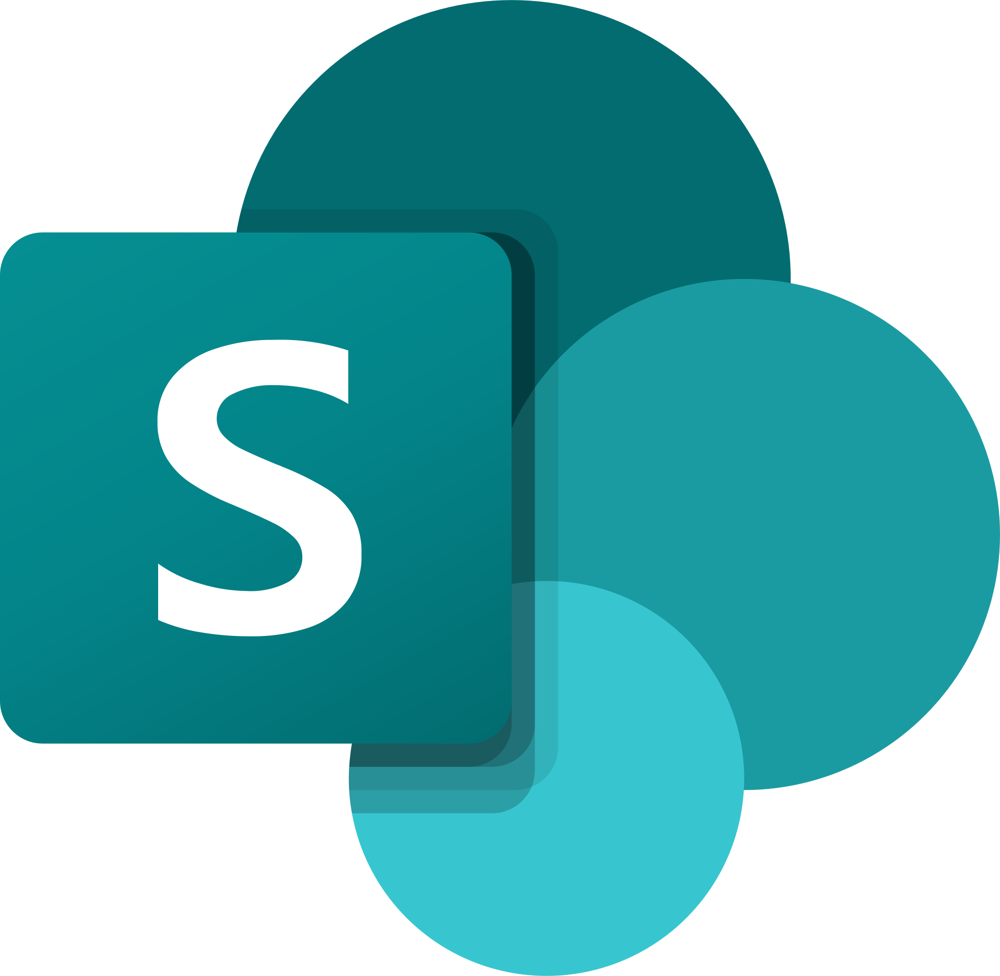
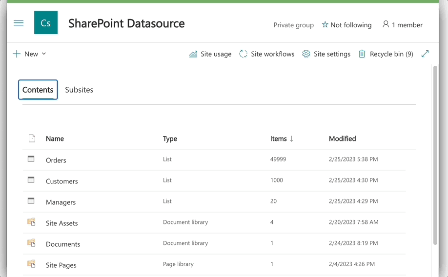

# cq-source-sharepoint

[CloudQuery](https://github.com/cloudquery/cloudquery) SharePoint Source community plugin.

<p float="left">
  
  
</p>

## Features

- Lists and Document Libraries data fetching
- Content Types based rollup
- User Information List data fetching
- Search Query data source
- User Profiles data source
- SharePoint Online support
- SharePoint On-Premise support
- Fast and potentially blazin fast with [spsync](https://github.com/koltyakov/spsync)



Vote for a feature you need or create a PR.

## Schema

```yaml
kind: source
spec:
  name: "sharepoint"
  registry: "github"
  path: "koltyakov/sharepoint"
  version: "v1.6.0" # provide the latest stable version
  destinations: ["postgresql"] # provide the list of used destinations
  spec:
    # Spec is mandatory
    # This plugin follows idealogy of explicit configuration
    # we can change this in future based on the feedback
```

### Authentication options

```yaml
# sharepoint.yml
# ...
spec:
  auth:
    strategy: "azurecert"
    creds:
      siteUrl: "https://contoso.sharepoint.com/sites/cloudquery"
      tenantId: "e1990a0a-dcf7-4b71-8b96-2a53c7e323e0"
      clientId: "2a53c7e323e0-e1990a0a-dcf7-4b71-8b96"
      certPath: "/path/to/cert.pfx"
      certPass: "certpass"
```

`creds` options are unique for different auth strategies. See more details in [Auth strategies](https://go.spflow.com/auth/strategies).

We recomment Azure AD (`azurecert`) or Add-In (`addin`) auth for production scenarios for SharePoint Online. Yet, other auth strategies are also available, e.g. `saml`, `device`. Some of the APIs could require using user contextual auth, for instance, Search API can't work without a user context.

SharePoint On-Premise auth is also supported, based on your farm configuration you can use: `ntlm`, `adfs` to name a few.

Need to hands on quickly without configuring Azure Apps or Addins or asking an admin to turn on app password? Try On-Demand auth:

```yaml
# sharepoint.yml
# ...
spec:
  auth:
    strategy: "ondemand"
    creds:
      siteUrl: "https://contoso.sharepoint.com/sites/cloudquery"
```

### Entities configuration

A single source `yml` configuration assumes fetching data from a single SharePoint site. If you need to fetch data from multiple sites, you can create multiple source configurations. Alternatevely, search based data fetching can be used for rollup scenarios grabbing data from as many sites as needed.

```yaml
# sharepoint.yml
# ...
spec:
  # A map of URIs with the list configurations
  # If no lists are provided, nothing will be fetched
  lists:
    # List or Document library URI - a relative path without a site URL
    # Can be checker in the browser URL (exclude site URL and view page path)
    Lists/ListEntityName:
      # REST `$select` OData modificator, fields entity properties array
      # Wildcard selectors `*` are intentionally not supported
      # If not provided, only default fields will be fetched (ID, Created, AuthorId, Modified, EditorId)
      select:
        - Title
        - Author/Title
        # Fields mapping via `->` arrow alias, when a specific field name is considered
        - EditorId -> editor
      # REST `$expand` OData modificator, fields entity properties array
      # When expanding an entity use selection of a nested entity property(s)
      # Optional, and in most of the cases we recommend to avoid it and
      # prefer to map nested entities to the separate tables
      expand:
        - Author
      # REST `$filter` OData modificator, a filter string
      # Don't use filters for large entities which potentially
      # can return more than 5000 in a view
      # such filtering will throttle no matter top limit is set
      filter: "Active eq true"
      # Optional, an alias for the table name
      # Don't map different lists to the same table - such scenario is not supported
      alias: "my_table"
    Lists/AnotherList:
      select:
        - Title
  # content_types: # see more below
  # mmd: # see more below
  # search: # see more below
  # profiles: # see more below
```

#### Content Types based rollup

Content Types based rollup allows to fetch data from multiple lists or document libraries based on the Content Type configuration.

All items based on the parent content type are fetched from all lists and subwebs below the context site URL.

```yaml
# sharepoint.yml
# ...
spec:
  # A map of Content Types with the rollup configurations
  content_types:
    # Base Content Type name or ID (e.g. "0x0101009D1CB255D" must be in quotes)
    Task:
      # REST `$select` OData modificator, fields entity properties array
      select:
        - Title
        - AssignedTo/Title
      # REST `$expand` OData modificator, fields entity properties array
      expand:
        - AssignedTo
      # Optional, an alias for the table name
      # the name of the alias is prefixed with `rollup_`
      alias: "task"
```

#### User Information List

Quite often you'd need getting User Information List for Author and Editor fields joining. This is a special case, and we have a dedicated configuration for it.

```yaml
# sharepoint.yml
# ...
spec:
  lists:
    _catalogs/users: # UIL list URI, source of People Picker lookup
      select:
        - Title
        - FirstName
        - LastName
        - JobTitle
        - Department
        - EMail
        - Deleted
      filter: "UserName ne null"
      alias: "user"
```

#### Document libraries

Document listariries are the same as lists in SharePoint, but with a few differences. And it's common to expand File entity to get file metadata.

Also, a document library URI usually doesn't contain `Lists/` prefix.

```yaml
# sharepoint.yml
# ...
spec:
  lists:
    Shared Documents:
      select:
        - FileLeafRef
        - FileRef
        - FileDirRef
        - File/Length
      expand:
        - File
      alias: "document"
```

#### Managed Metadata

To configure managed metadata fetching, you need to provide a term set ID (GUID) and an optional alias for the table name.

```yaml
# sharepoint.yml
# ...
spec:
  # A map of MMD term sets IDs (GUIDs)
  mmd:
    # Term set ID
    8ed8c9ea-7052-4c1d-a4d7-b9c10bffea6f:
      # Optional, an alias for the table name
      # the name of the alias is prefixed with `mmd_`
      alias: "department"
```

#### User Profiles

User Profiles are fetched via Search API, so the search should be configured in the farm.

Search drived data source can be user only with user associated authentication strategies. E.g. it won't work with `addin` strategy.

```yaml
# sharepoint.yml
# ...
spec:
  # Include `profiles` property to fetch user profiles
  # Object structure for extensibility (adding custom properties)
  profiles:
    enabled: true
    # Optional, an alias for the table name
    alias: "profile"
```

#### Search queries

Search drived data source can be user only with user associated authentication strategies. E.g. it won't work with `addin` strategy.

```yaml
# sharepoint.yml
# ...
spec:
  # A map of search queries
  search:
    # Query name (whatever you want to name a resulted table)
    # Should be unique within other compound aliases
    documents:
      # Required, search query text
      # https://learn.microsoft.com/en-us/sharepoint/dev/general-development/sharepoint-search-rest-api-overview#querytext-parameter
      query_text: "*"
      # Optional, the managed properties to return in the search results
      # https://learn.microsoft.com/en-us/sharepoint/dev/general-development/sharepoint-search-rest-api-overview#selectproperties
      # By defining the list of properties, you also tell the plugin
      # to have correcponding columns in the table
      select_properties:
        - Size
        - Title
        - ContentTypeId
        - IsDocument
        - FileType
        - DocId
        - SPWebUrl
        - SiteId
        - WebId
        - ListId
      # Optional, whether duplicate items are removed from the results
      # https://learn.microsoft.com/en-us/sharepoint/dev/general-development/sharepoint-search-rest-api-overview#trimduplicates
      trim_duplicates: true
    profiles:
      query_text: "*",
      trim_duplicates: false
      # The result source ID to use for executing the search query.
      # https://learn.microsoft.com/en-us/sharepoint/dev/general-development/sharepoint-search-rest-api-overview#sourceid
      source_id: "b09a7990-05ea-4af9-81ef-edfab16c4e31"
```

## Get started

### Install CloudQuery

Follow [quickstart instructions](https://www.cloudquery.io/docs/quickstart/).

### Source sample data

Provision and seed some sample data. [See more](./cmd/seed/README.md). Which satisfy the schema below.

### Auth configuration

```bash
# .env or env vars export
# See more details in https://go.spflow.com/auth/strategies
SP_SITE_URL=https://contoso.sharepoint.com/sites/site
```

or use "ondeman" auth.

### Source configuration

```yaml
# sharepoint.yml
kind: source
spec:
  name: "sharepoint"
  registry: "github"
  path: "koltyakov/sharepoint"
  version: "v1.6.0" # https://github.com/koltyakov/cq-source-sharepoint/releases
  destinations: ["sqlite"]
  spec:
    auth:
      strategy: "ondemand"
      creds:
        siteUrl: ${SP_SITE_URL}
        # align creds with the used strategy
    lists:
      _catalogs/users:
        select:
          - Title
          - FirstName
          - LastName
          - JobTitle
          - Department
          - EMail
          - Deleted
        filter: "UserName ne null"
        alias: "user"
      Shared Documents:
        select:
          - FileLeafRef
          - FileRef
          - FileDirRef
          - Author/Title
          - File/Length
        expand:
          - Author
          - File
        alias: "document"
      Lists/Managers:
        select:
          - Title
        alias: "manager"
      Lists/Customers:
        select:
          - Title
          - RoutingNumber
          - Region
          - Revenue
          - ManagerId
        alias: "customer"
      Lists/Orders:
        select:
          - Title
          - CustomerId
          - OrderNumber
          - OrderDate
          - Total
        alias: "order"
```

### Destination configuration

For the sake of simplicity, we'll use SQLite destination.

```yaml
# sqlite.yml
kind: destination
spec:
  name: sqlite
  path: cloudquery/sqlite
  version: "v1.3.5"
  spec:
    connection_string: ./db.sql
```

### Run CloudQuery

```bash
# With auth environment variables exported
cloudquery sync sharepoint.yml sqlite.yml
```

You should see the following output:

```bash
Loading spec(s) from sharepoint_reg.yml, sqlite.yml
Downloading https://github.com/koltyakov/cq-source-sharepoint/releases/download/v1.0.0/cq-source-sharepoint_darwin_arm64.zip
Downloading 100% |█████████████████████████████████████████████████████████| (5.2/5.2 MB, 10 MB/s)
Starting migration with 5 tables for: sharepoint (v1.0.0) -> [sqlite (v1.6.0)]
Migration completed successfully.
Starting sync for: sharepoint (v1.0.0) -> [sqlite (v1.6.0)]
Sync completed successfully. Resources: 37478, Errors: 0, Panics: 0, Time: 21s
```

Check for destination database data.

---

Powered by [gosip](https://github.com/koltyakov/gosip).
