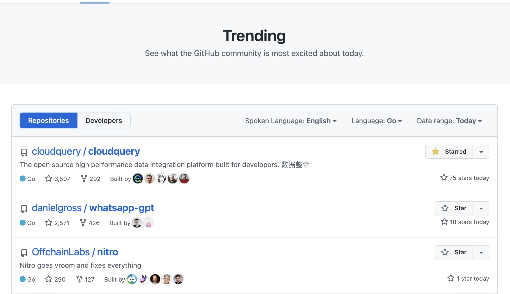

# Welcome SharePoint to CloudQuery family


## Introduction

[CloudQuery](https://github.com/cloudquery/cloudquery) is a data extraction and transformation tool that allows you to sync your cloud resources to target databases. CloudQuery is open source a vendor agnostic tool with a majority of source and destinations [integrations](https://www.cloudquery.io/integrations) via an ecosystem of plugins. CloudQuery currently supports AWS, Azure, GCP, GitHub, GitLab, and more. It's build on Go programming language, lightweight, fast, and easy to use. For the last couple of weeks I have beed seeing a lot of interest in CloudQuery and appearing in GitHub trends sometimes overtaking such a fancy ChatGPT libraires.



> Yep, I have a filter by Go language, yet without the filter it's still in the top 10 as of today.

In the beginning of the previous week I was wondering how to grab some AWS Step Functions metadata with the tool and also was researching if I could use Jira as a datasource. Unfortunately, Jira is not an option yet, but maintainers are such a good guysshow transparency and almost an instant reaction to questions. So I suggested my help, yet not with Jira, but something I'm really good with - SharePoint.

The policy of CloudQuery for introducing new plugins is to have a future for official or community support for the plugin, and existence of a stable SDK in Go for the integrated system.

After highlighting my will to help, the mainteiners of the project have provided the initial starter version of the plugin for me with an unimaginative speed. So I decided to not get out of the shown pace and catch up with the plugin development. So, can you imagine the v1.0.0 is already out and available use in less than a week.

Glad to introduce you the first version of the SharePoint plugin for CloudQuery. The plugin is available on [GitHub](https://github.com/koltyakov/cq-source-sharepoint) and can be installed via CloudQuery CLI.

Current version supports SharePoint Online and SharePoint On-Premise and Lists and Document Libraries as a data sources; and fine configuration for what's to sync.

It is not indends to eat an elephant in one bite, so the plugin is not covering all the SharePoint features, yet it's a good start. I'm planning to add more features in the future, so stay tuned. Such as Managed Metadata, User Profile services, Search queries, etc. Or embedding SharePoint change API to process incremental syncs in a blink of an eye.

You can already use SharePoint with CloudQuery since today. Let me show you how get started.

## Getting started


### Prerequisites

- [CloudQuery CLI installed](https://www.cloudquery.io/docs/quickstart)
- SharePoint Online or On-Premise site
- Credentials for the site using one of the [supported auth strategies](https://go.spflow.com/auth/strategies)
- Knowing basics of SharePoint REST API (entities and fields naming)
- Target destination (PostgreSQL, MySQL, etc.) configured

### Datasource schema

Integration schema is stored in an `.yml` file, e.g. `sharepoint.yml`:

```yaml
kind: source
spec:
  name: "sharepoint"
  registry: "github"
  path: "koltyakov/sharepoint"
  # provide the latest stable version
  # https://github.com/koltyakov/cq-source-sharepoint/releases
  version: "v1.0.0"
  destinations: ["sqlite"] # provide the list of used destinations
  spec:
    # Spec is mandatory
    # This plugin follows idealogy of explicit configuration
    auth:
      strategy: "azurecert"
      creds:
        siteUrl: "https://contoso.sharepoint.com/sites/cloudquery"
        tenantId: "e1990a0a-dcf7-4b71-8b96-2a53c7e323e0"
        clientId: "2a53c7e323e0-e1990a0a-dcf7-4b71-8b96"
        certPath: "/path/to/cert.pfx"
        certPass: "certpass"
    # A map of URIs to the list configuration
    # If no lists are provided, nothing will be fetched
    lists:
      # List or Document library URI - a relative path without a site URL
      # Can be checker in the browser URL (exclude site URL and view page path)
      Lists/ListEntityName:
        # REST's `$select` OData modificator, fields entity properties array
        # Wildcard selectors `*` are intentionally not supported
        # If not provided, only default fields will be fetched (ID, Created, AuthorId, Modified, EditorId)
        select:
          - Title
          - Author/Title
        # REST's `$expand` OData modificator, fields entity properties array
        # When expanding an entity use selection of a nested entity property(s)
        # Optional, and in most of the cases we recommend to avoid it and
        # prefer to map nested entities to the separate tables
        expand:
          - Author
        # Optional, an alias for the table name
        # Don't map different lists to the same table - such scenariou is not supported
        alias: "my_table"
      Lists/AnotherList:
        select:
          - Title
```

#### Authentication

The plugin is powered with [gosip](https://github.com/koltyakov/gosip) library, so all of the variety of authentication options are available. Shameless plug, I'll be super happy if you star it on GitHub.

`creds` options are unique for different auth strategies. See more details in [Auth strategies](https://go.spflow.com/auth/strategies).

I always recomment Azure AD (`azurecert`) or Add-In (`addin`) auth for production scenarios for SharePoint Online. Yet, other auth strategies are available for testing and development purposes, e.g. `saml`, `device`.

SharePoint On-Premise auth is also supported, based on your farm configuration you can use: `ntlm`, `adfs` to name a few.

#### Lists configuration

The plugin is designed to be flexible and configurable. You can configure what to sync and how to sync it. The plugin is using SharePoint REST API, so you can use `$select` and `$expand` OData modifiers to configure what to sync.

Also you can use `alias` option to map different lists to a have a name you like in the destination database.

### Destination configuration

There is a variety of [targets](https://www.cloudquery.io/docs/plugins/destinations/overview) to sync to. I'd recommend starting something simple like SQLite. You can also use PostgreSQL or Snowflake, but you'll need to have a database configured.

```yaml
# sqlite.yml
kind: destination
spec:
  name: sqlite
  path: cloudquery/sqlite
  version: "v1.3.0"
  spec:
    connection_string: ./db.sql
```

### Run CloudQuery sync

```bash
# With auth environment variables exported
cloudquery sync sharepoint.yml sqlite.yml
```

You should see the following output:

```bash
Loading spec(s) from sharepoint_reg.yml, sqlite.yml
Downloading https://github.com/koltyakov/cq-source-sharepoint/releases/download/v1.0.0/cq-source-sharepoint_darwin_arm64.zip
Downloading 100% |█████████████████████████████████████████████████████████| (5.2/5.2 MB, 10 MB/s)
Starting migration with 5 tables for: sharepoint (v1.0.0) -> [sqlite (v1.3.0)]
Migration completed successfully.
Starting sync for: sharepoint (v1.0.0) -> [sqlite (v1.3.0)]
Sync completed successfully. Resources: 37478, Errors: 0, Panics: 0, Time: 21s
```

That's it! You can now query your SharePoint data in the destination database.

## Conclusion

My firm belief that a diversity of tools and integration only improve a platform. Even while SharePoint and Microsoft lands have their own set of tools (such as PowerBI, Power Automate connectors, SSIS to name a few), I believe that CloudQuery can be a great addition to the toolset. Which can allow damn cheep, cloud native and lightweight integrations of SharePoint data. Also such tools can expose SharePoint to a larger and not necessarily SharePoint Pro audience.

I hope you'll find the plugin useful and simple to use. I'm looking forward to your feedback and feature requests. Please feel free to open an issue on [GitHub](https://github.com/koltyakov/cq-source-sharepoint) and share your thoughts and use cases.
